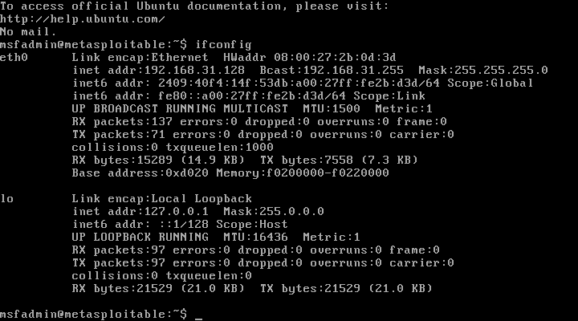
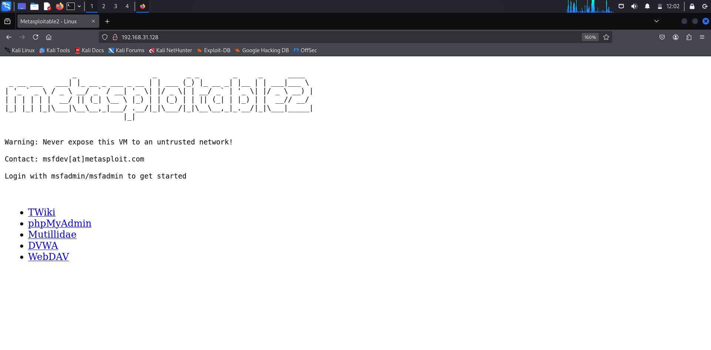
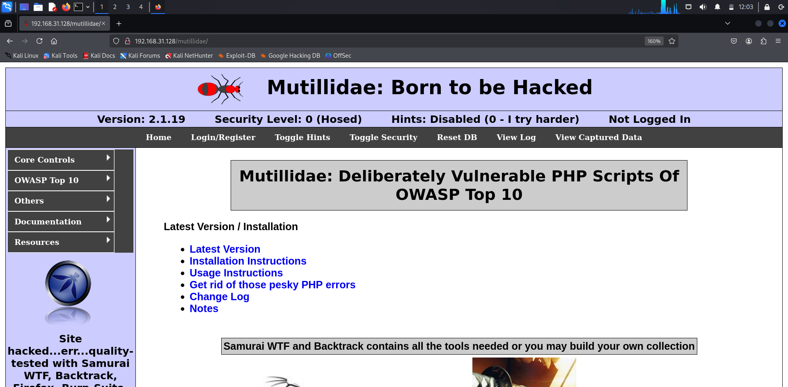
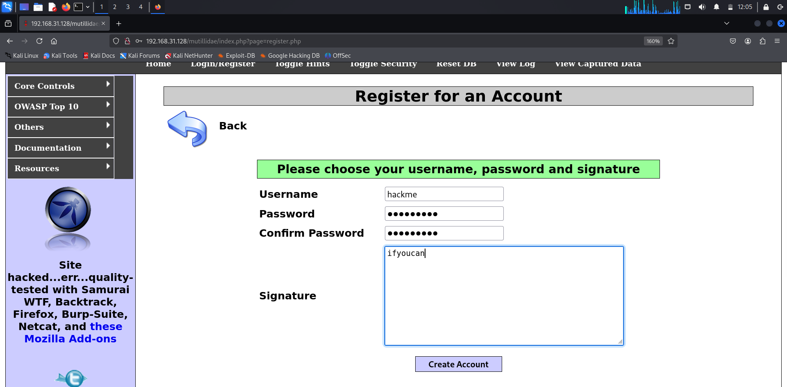
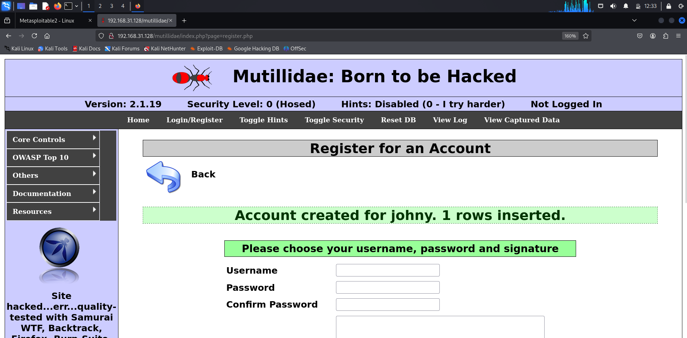
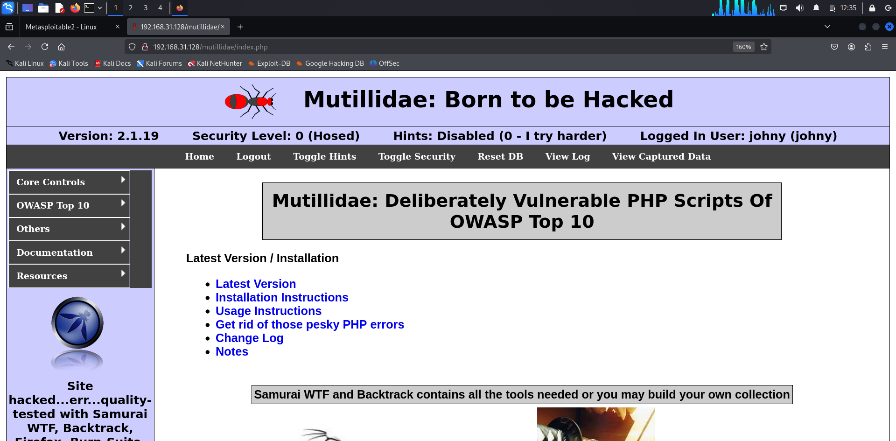
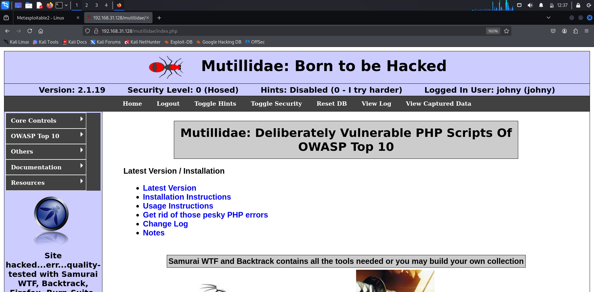
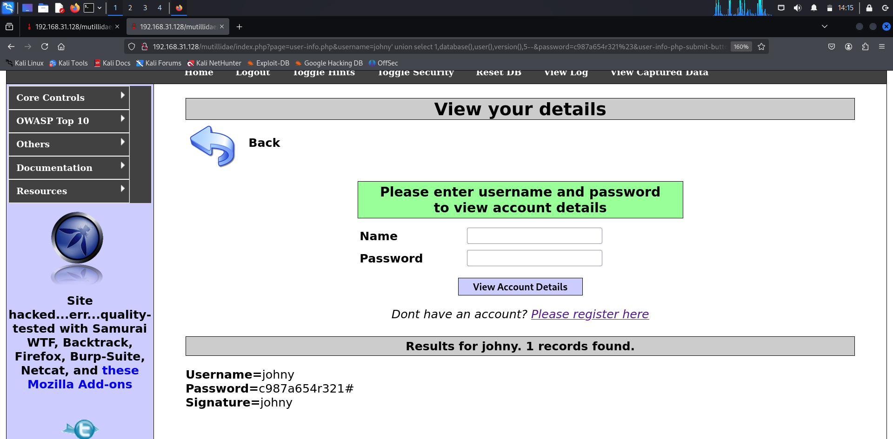
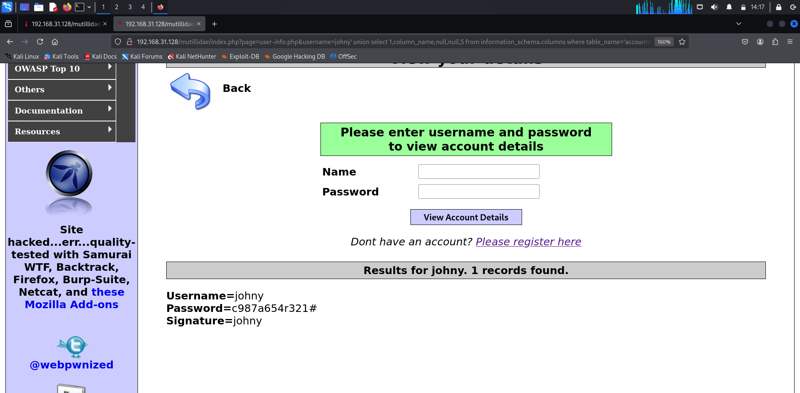
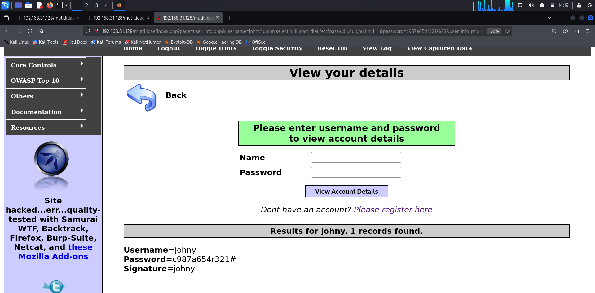

# sqlinjection
Exploiting SQL Injection vulnerability

# AIM:
To exploit SQL Injection vulnerability using Multidae web application in Metasploitable2

## DESIGN STEPS:

### Step 1:

Install kali linux either in partition or virtual box or in live mode

### Step 2:

Investigate on the various categories of tools as follows:

### Step 3:

Open terminal and try execute some kali linux commands

## EXECUTION STEPS AND ITS OUTPUT:

IP ADDRESS OF METASPLOIT

METASPLOIT PAGE

MUTILLIDAE PAGE

MUTILLIDAE REGISTRATION

MUTILLIDAE LOGIN

MUTILLIDAE ADMIN LOGIN

ACCESS THROUGH QUERY

ORDER BY QUERY

UNION SELECT QUERY

DATABASE INFORMATION QUERY

TABLE LISTING QUERY

CREDENTIALS DUMPING QUERY

COLUMN NAME LISTING QUERY

FILE READING QUERY

## RESULT:
The SQL Injection vulnerability is successfully exploited using the Multidae web application in Metasploitable2.
